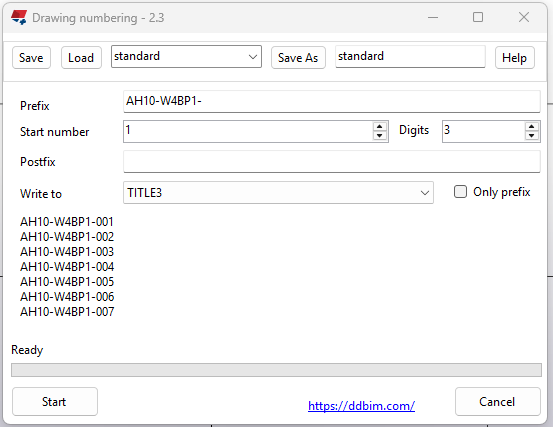
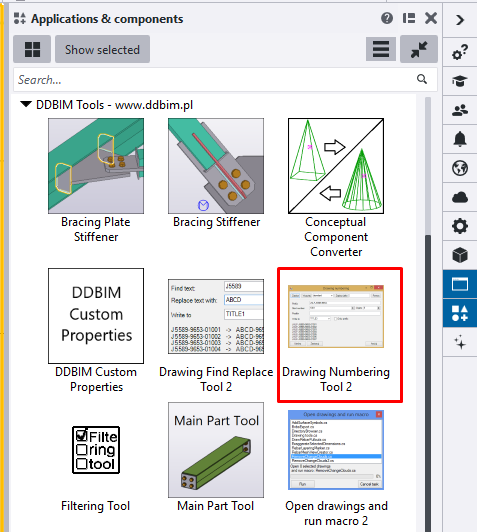

# Drawing Numbering Tool for Tekla Structures

[](LICENSE)
[](https://www.tekla.com/)
[](https://dotnet.microsoft.com/)

A Tekla Structures plugin that speeds up renumbering of selected drawings and writing complex, structured numbers into drawing attributes. Designed for detailers and BIM engineers who deal with hundreds of drawings and a strict numbering scheme.




## Features

- **Batch renumbering** of all selected drawings in one click
- Configurable **Prefix**, **Start number**, **Digits** (leading zeros) and **Postfix**
- Write the result to **NAME**, **TITLE1**, **TITLE2**, **TITLE3** or any **User Defined Attribute (UDA)**
- **Only prefix** mode for tag-style fields (writes the prefix only, no number)
- Works with all drawing types: **GA**, **Assembly**, **Single-Part**, **Cast Unit**, **Multi**
- Progress bar with estimated time remaining and full **cancel** support. Cancel can take couple of seconds so don't panic. 

## Installation

1. Download the package from [Tekla Warehouse](https://warehouse.tekla.com/#!/catalog/details/394df5f7-c31c-4037-a6d6-c0d48a7fef41)
2. Close all Tekla Structures programs.
3. Double‑click the `.tsep` file, select your tekla version and click install. Open Tekla Structures. 
4. If double click install fails then you can copy tsep file to ```%envFolder\Extensions\To be installed```
3. Open Tekla Structures. *Filtering Tool* will appear in the *Applications & components* catalog under the **DDBIM** group.

For very old Tekla Strucutres use msi installer.

## Usage

1. Open **Document Manager** and select the drawings you want to renumber.
2. Run **Drawing Numbering Tool** from the Applications & components catalog.
3. Set the parameters:
   - **Prefix** / **Postfix** — fixed text wrapping the number
   - **Start number** — first number in the sequence
   - **Digits** — total digit count (e.g. `3` produces `001`, `002`, …)
   - **Write to** — `NAME`, `TITLE1`–`TITLE3`, or a chosen UDA
   - **Only prefix** — write the prefix verbatim, skipping the number
4. Click **Start** and confirm.

**Example.** With `Prefix = 78UKH-YJKO23-`, `Start number = 1`, `Digits = 3`, `Postfix = -UIL`, the selected drawings are renumbered to:

```
78UKH-YJKO23-001-UIL
78UKH-YJKO23-002-UIL
78UKH-YJKO23-003-UIL
...
```

## Supported Tekla versions

Two `.tsep` packages are published — pick the one for your Tekla version:

| Tekla Structures   | TSEP file                                              |
|--------------------|--------------------------------------------------------|
| 2016 – 2024        | `DDBIMDrawingNumberingTool_Tekla2016-Tekla2024.tsep`   |
| 2025 and newer     | `DDBIMDrawingNumberingTool_Tekla2025_or_newer.tsep`    |

Two packages exist because Tekla 2025 changed the TSEP signing algorithm; older Tekla versions cannot verify package signed for 2025+.

For super old Tekla Strucutres 20.0-21.1 use msi installer. 

## Build from source

Requirements: **Visual Studio 2017+** with **.NET Framework 4.7.2** developer pack, and a local Tekla Structures install (for `TeklaExtensionPackage.BatchBuilder.exe`).

```bat
:: From the VisualStudio2017 folder
1_Build.bat          :: rebuilds the solution with msbuild
3_CreateTSEP.bat     :: packages both .tsep files via Tekla's BatchBuilder
```

The solution `VisualStudio2017/DrawingNumberingPlugin.sln` contains four projects:

- `DrawingNumberingPlugin` — the in-Tekla plugin (DLL)
- `DrawingNumberingApp` — the WinForms UI (EXE) launched by the plugin
- `DrawingNumberingPlugin_InstallerClass` — installer helper for legacy Tekla versions
- `DrawingNumberingPlugin_Setup` — MSI installer legacy Tekla versions

## License

Released under the [MIT License](LICENSE) — Copyright © 2018 Dawid Dyrcz.

More [Tekla Structures plugins ](https://ddbim.com/category/tekla-structures-plugins/)
